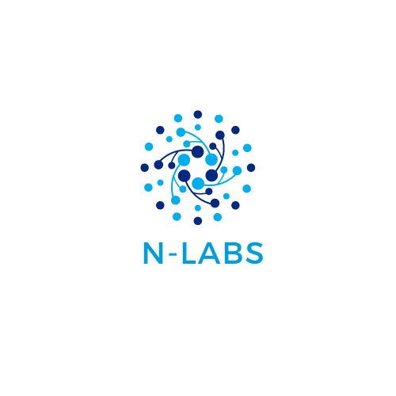

    

N-Labs is a comprehensive software solution designed to assist with the organization and management of labs and practical courses within a department. It aims to streamline academic and administrative processes for both students and faculty members. The platform includes features such as the submission of reports, grading, sharing of learning materials, tracking of lab resources and tools, and much more.
